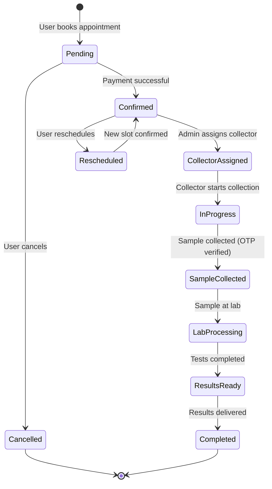

# Laboratory Management Module - Implementation Guide for Healthcare Systems

> **Purpose**: This guide provides a comprehensive blueprint for integrating HahuLabs' laboratory management features into an existing healthcare management system as a modular component.

---

## Executive Summary

This document outlines how to implement a complete **Laboratory Management System** as a module within your existing healthcare platform. The implementation covers:

- 🧪 **Lab Test Catalog Management**
- 📅 **Appointment Booking & Scheduling**
- 🏥 **Multi-Vendor Lab Support**
- 💰 **Payment & Commission Processing**
- 📱 **Sample Collection Workflow**
- 📊 **Prescription & Results Management**
- 🔔 **Multi-Channel Notifications**

---

## Table of Contents

1. [Architecture Overview](#architecture-overview)
2. [Core Modules & Dependencies](#core-modules--dependencies)
3. [Database Schema Design](#database-schema-design)
4. [Implementation Phases](#implementation-phases)
5. [API Endpoints](#api-endpoints)
6. [Integration Points](#integration-points)
7. [Security Considerations](#security-considerations)
8. [Testing Strategy](#testing-strategy)

---

## Architecture Overview

### Modular Design Pattern

The laboratory management system follows a **modular monolith** architecture where each feature is self-contained but shares common infrastructure.


### Technology Stack Requirements

| Component | Technology | Purpose |
|-----------|-----------|---------|
| **Backend Framework** | Laravel 11+ (PHP 8.2+) | Core application logic |
| **Frontend** | Vue.js 3 + Bootstrap 5 | User interface |
| **Database** | MySQL/PostgreSQL | Data persistence |
| **File Storage** | S3/Local + Spatie Media Library | Document management |
| **Queue System** | Redis/Database | Background jobs |
| **Cache** | Redis/Memcached | Performance optimization |
| **Notifications** | Firebase (Push), Twilio (SMS) | Multi-channel alerts |
| **Payments** | Stripe, Razorpay | Payment processing |

---

## Core Modules & Dependencies

### 1. Lab Module (Foundation)

**Purpose**: Manage laboratory entities, their locations, operating hours, and credentials.

**Key Features**:
- Lab registration and profile management
- Multi-location support
- Operating hours with break times
- License and accreditation tracking
- Tax configuration
- Payment gateway integration
- Geolocation-based lab discovery

**Database Tables**:
- `labs` - Main lab information
- `lab_sessions` - Operating hours by day
- `lab_location_mapping` - Multiple location support
- `lab_tax_mapping` - Tax configuration

**Dependencies**:
- User module (vendor relationship)
- World module (country, state, city)
- Tax module
- Media library (logos, documents)

**Implementation Priority**: ⭐⭐⭐⭐⭐ (Phase 1 - Critical)

---

### 2. Test Catalog Module

**Purpose**: Manage laboratory tests and test packages offered by labs.

**Key Features**:
- Individual test management
- Test packages/bundles
- Pricing and discounts
- Test categories
- Sample requirements
- Preparation instructions
- Test duration and reporting time

**Database Tables**:
- `catlog_management` - Individual tests
- `package_management` - Test packages
- `categories` - Test categorization
- `package_test_mapping` - Package composition

**Dependencies**:
- Lab module
- Category module
- Media library (test images)

**Implementation Priority**: ⭐⭐⭐⭐⭐ (Phase 1 - Critical)

---

### 3. Appointment Module (Core Workflow)

**Purpose**: Handle the complete appointment lifecycle from booking to completion.

**Key Features**:
- Appointment booking
- Time slot management
- Collection type (home/lab)
- Appointment status tracking
- Rescheduling and cancellation
- OTP verification
- Multi-member booking
- Prescription upload

**Database Tables**:
- `appointments` - Main appointment data
- `appointment_status` - Status reference
- `appointment_transactions` - Payment records
- `appointment_collector_mapping` - Collector assignment
- `appointment_otp_mapping` - OTP verification
- `appointment_package_mapping` - Package details
- `appointment_activities` - Activity log
- `live_location` - Real-time collector tracking

**Appointment Workflow**:



**Dependencies**:
- Lab module
- Test catalog module
- User module
- Collector module
- Payment module
- Prescription module
- Notification module

**Implementation Priority**: ⭐⭐⭐⭐⭐ (Phase 2 - Critical)

---

### 4. Sample Collector Module

**Purpose**: Manage sample collectors and their assignments.

**Key Features**:
- Collector registration
- Lab-collector mapping
- Real-time location tracking
- Availability management
- Collection history
- Performance metrics

**Database Tables**:
- `collector_lab_mapping` - Collector-lab relationships
- `live_location` - GPS tracking
- User table extension for collectors

**Dependencies**:
- User module
- Lab module
- Appointment module

**Implementation Priority**: ⭐⭐⭐⭐ (Phase 2 - High)

---

### 5. Payment & Wallet Module

**Purpose**: Handle payments, refunds, and digital wallet transactions.

**Key Features**:
- Multiple payment gateways (Stripe, Razorpay)
- Digital wallet
- Wallet top-up
- Payment history
- Refund processing
- Cash on collection

**Database Tables**:
- `wallets` - User wallet balances
- `wallet_transactions` - Transaction history
- `cash_payment_histories` - Cash payments
- `appointment_transactions` - Appointment payments

**Dependencies**:
- User module
- Appointment module
- Payment gateway APIs

**Implementation Priority**: ⭐⭐⭐⭐⭐ (Phase 2 - Critical)

---

### 6. Commission Module

**Purpose**: Calculate and track commissions for vendors and platform.

**Key Features**:
- Configurable commission rates
- Automatic commission calculation
- Commission reports
- Payout tracking

**Database Tables**:
- `commission_earnings` - Commission records
- `vendor_commissions` - Commission configuration
- `payouts` - Payout requests

**Dependencies**:
- Appointment module
- Vendor module
- Payment module

**Implementation Priority**: ⭐⭐⭐ (Phase 3 - Medium)

---

### 7. Prescription Module

**Purpose**: Manage prescription uploads and requirements.

**Key Features**:
- Prescription upload
- Prescription verification
- Prescription-based test suggestions
- Document storage

**Database Tables**:
- `prescriptions` - Prescription metadata
- Media library for files

**Dependencies**:
- Appointment module
- Media library

**Implementation Priority**: ⭐⭐⭐ (Phase 2 - Medium)

---

### 8. Vendor Management Module

**Purpose**: Onboard and manage laboratory vendors.

**Key Features**:
- Vendor registration
- Subscription plans
- Vendor approval workflow
- Bank account management
- Earnings dashboard
- Payout requests

**Database Tables**:
- User table (vendor role)
- `subscriptions` - Vendor subscriptions
- `banks` - Bank account details
- `payouts` - Payout requests

**Dependencies**:
- User module
- Lab module
- Subscription module
- Payment module

**Implementation Priority**: ⭐⭐⭐⭐ (Phase 1 - High)

---

### 9. Notification Module

**Purpose**: Send multi-channel notifications to users.

**Key Features**:
- Email notifications
- SMS notifications (Twilio)
- Push notifications (Firebase)
- Template management
- Notification preferences
- Notification history

**Database Tables**:
- `notification_templates` - Email/SMS templates
- Laravel's notifications table

**Dependencies**:
- User module
- All feature modules

**Implementation Priority**: ⭐⭐⭐⭐ (Phase 2 - High)

---

### 10. Supporting Modules

#### Review & Rating Module
- Lab reviews
- Collector reviews
- Star ratings
- Review moderation

#### Coupon Module
- Discount coupons
- Promo codes
- Usage tracking
- Expiry management

#### Report Module
- Appointment reports
- Revenue reports
- Lab performance
- Collector performance

**Implementation Priority**: ⭐⭐ (Phase 4 - Low)

---

## Database Schema Design

### Core Tables

#### 1. Labs Table

```sql
CREATE TABLE labs (
    id BIGINT PRIMARY KEY AUTO_INCREMENT,
    name VARCHAR(255) NOT NULL,
    slug VARCHAR(255) UNIQUE NOT NULL,
    lab_code VARCHAR(100),
    description TEXT,
    vendor_id BIGINT,
    
    -- Contact
    phone_number VARCHAR(20),
    email VARCHAR(255),
    
    -- Address
    address_line_1 VARCHAR(255),
    address_line_2 VARCHAR(255),
    city_id INT,
    state_id INT,
    country_id INT,
    postal_code VARCHAR(20),
    latitude DECIMAL(10,8),
    longitude DECIMAL(11,8),
    
    -- Operating
    time_slot INT,
    
    -- Credentials
    license_number VARCHAR(100),
    license_expiry_date DATE,
    accreditation_type VARCHAR(100),
    accreditation_expiry_date DATE,
    tax_identification_number VARCHAR(100),
    
    -- Payment
    payment_modes JSON,
    payment_gateways JSON,
    
    -- Status
    status BOOLEAN DEFAULT 1,
    
    -- Audit
    created_by INT UNSIGNED,
    updated_by INT UNSIGNED,
    deleted_by INT UNSIGNED,
    created_at TIMESTAMP,
    updated_at TIMESTAMP,
    deleted_at TIMESTAMP NULL,
    
    FOREIGN KEY (vendor_id) REFERENCES users(id) ON DELETE CASCADE,
    FOREIGN KEY (city_id) REFERENCES cities(id),
    FOREIGN KEY (state_id) REFERENCES states(id),
    FOREIGN KEY (country_id) REFERENCES countries(id)
);
```

#### 2. Appointments Table

```sql
CREATE TABLE appointments (
    id BIGINT PRIMARY KEY AUTO_INCREMENT,
    status VARCHAR(50) DEFAULT 'pending',
    
    -- Parties
    customer_id BIGINT NOT NULL,
    other_member_id BIGINT NULL,
    vendor_id BIGINT,
    lab_id BIGINT,
    
    -- Test Details
    test_id INT,
    test_type VARCHAR(50) DEFAULT 'test_case',
    
    -- Scheduling
    appointment_date DATE,
    appointment_time TIME,
    collection_type VARCHAR(50) DEFAULT 'lab',
    address_id INT,
    
    -- Pricing
    amount DOUBLE DEFAULT 0,
    test_discount_amount DOUBLE DEFAULT 0,
    total_amount DOUBLE DEFAULT 0,
    
    -- Status Tracking
    submission_status VARCHAR(50) DEFAULT 'pending',
    test_case_status VARCHAR(50),
    rejected_id INT,
    
    -- Additional Info
    by_suggestion BOOLEAN DEFAULT 0,
    cancellation_reason TEXT,
    symptoms TEXT,
    reschedule_reason VARCHAR(255),
    
    -- Audit
    created_by INT UNSIGNED,
    updated_by INT UNSIGNED,
    deleted_by INT UNSIGNED,
    created_at TIMESTAMP,
    updated_at TIMESTAMP,
    deleted_at TIMESTAMP NULL,
    
    FOREIGN KEY (customer_id) REFERENCES users(id) ON DELETE CASCADE,
    FOREIGN KEY (vendor_id) REFERENCES users(id) ON DELETE CASCADE,
    FOREIGN KEY (lab_id) REFERENCES labs(id) ON DELETE CASCADE
);
```

#### 3. Test Catalog Table

```sql
CREATE TABLE catlog_management (
    id BIGINT PRIMARY KEY AUTO_INCREMENT,
    name VARCHAR(255) NOT NULL,
    slug VARCHAR(255) UNIQUE,
    lab_id BIGINT,
    category_id INT,
    
    -- Test Details
    description TEXT,
    sample_type VARCHAR(100),
    preparation_instructions TEXT,
    reporting_time VARCHAR(50),
    
    -- Pricing
    price DOUBLE,
    discount_price DOUBLE,
    discount_type VARCHAR(20),
    
    -- Status
    status BOOLEAN DEFAULT 1,
    is_featured BOOLEAN DEFAULT 0,
    
    -- Audit
    created_by INT UNSIGNED,
    updated_by INT UNSIGNED,
    deleted_by INT UNSIGNED,
    created_at TIMESTAMP,
    updated_at TIMESTAMP,
    deleted_at TIMESTAMP NULL,
    
    FOREIGN KEY (lab_id) REFERENCES labs(id) ON DELETE CASCADE,
    FOREIGN KEY (category_id) REFERENCES categories(id)
);
```

### Relationship Diagram


---

## Implementation Phases

### Phase 1: Foundation (Weeks 1-3)

**Goal**: Set up core infrastructure and basic lab management.

#### Tasks:

1. **Module Structure Setup**
   - Create modular directory structure
   - Set up service providers
   - Configure autoloading
   - Establish naming conventions

2. **Database Schema**
   - Create migration files for core tables
   - Set up relationships
   - Add indexes for performance
   - Create seeders for test data

3. **Lab Module Implementation**
   - Lab CRUD operations
   - Lab profile management
   - Location management
   - Operating hours configuration
   - Media upload (logo, documents)

4. **Vendor Module**
   - Vendor registration
   - Vendor approval workflow
   - Basic vendor dashboard

5. **Test Catalog Module**
   - Test CRUD operations
   - Category management
   - Pricing configuration
   - Test search and filtering

**Deliverables**:
- ✅ Working lab registration
- ✅ Test catalog management
- ✅ Vendor onboarding flow
- ✅ Admin dashboard for lab approval

---

### Phase 2: Appointment Workflow (Weeks 4-7)

**Goal**: Implement complete appointment booking and management.

#### Tasks:

1. **Appointment Booking**
   - Lab and test browsing
   - Time slot selection
   - Address management
   - Cart functionality
   - Booking confirmation

2. **Payment Integration**
   - Payment gateway setup (Stripe/Razorpay)
   - Wallet implementation
   - Payment processing
   - Refund handling
   - Cash on collection

3. **Collector Module**
   - Collector registration
   - Lab-collector mapping
   - Collector assignment logic
   - Real-time location tracking

4. **Appointment Management**
   - Status tracking
   - Rescheduling
   - Cancellation
   - OTP verification
   - Sample collection workflow

5. **Notification System**
   - Email notifications
   - SMS notifications
   - Push notifications
   - Template management

**Deliverables**:
- ✅ End-to-end appointment booking
- ✅ Payment processing
- ✅ Collector assignment
- ✅ Status tracking
- ✅ Notifications

---

### Phase 3: Advanced Features (Weeks 8-10)

**Goal**: Add commission, prescriptions, and reporting.

#### Tasks:

1. **Commission Engine**
   - Commission calculation
   - Vendor earnings tracking
   - Payout management
   - Commission reports

2. **Prescription Module**
   - Prescription upload
   - Prescription verification
   - Test suggestions based on prescription

3. **Review & Rating**
   - Lab reviews
   - Collector reviews
   - Rating aggregation
   - Review moderation

4. **Coupon System**
   - Coupon creation
   - Discount application
   - Usage tracking
   - Expiry management

5. **Reporting**
   - Appointment reports
   - Revenue reports
   - Lab performance analytics
   - Collector performance metrics

**Deliverables**:
- ✅ Commission tracking
- ✅ Prescription management
- ✅ Review system
- ✅ Coupon functionality
- ✅ Comprehensive reports

---

### Phase 4: Optimization & Polish (Weeks 11-12)

**Goal**: Performance optimization and user experience enhancement.

#### Tasks:

1. **Performance Optimization**
   - Database query optimization
   - Caching implementation
   - Image optimization
   - API response time improvement

2. **Mobile Responsiveness**
   - Mobile UI refinement
   - Touch interactions
   - Mobile-specific features

3. **Testing**
   - Unit tests
   - Integration tests
   - End-to-end tests
   - Load testing

4. **Documentation**
   - API documentation
   - User guides
   - Admin guides
   - Developer documentation

**Deliverables**:
- ✅ Optimized performance
- ✅ Mobile-friendly interface
- ✅ Comprehensive test coverage
- ✅ Complete documentation

---

## API Endpoints

### Lab Management APIs

```
GET    /api/labs                      # List all labs
GET    /api/labs/{id}                 # Get lab details
POST   /api/labs                      # Create lab (vendor)
PUT    /api/labs/{id}                 # Update lab
DELETE /api/labs/{id}                 # Delete lab
GET    /api/labs/nearby               # Get nearby labs (lat, lng, radius)
GET    /api/labs/{id}/tests           # Get lab's tests
GET    /api/labs/{id}/packages        # Get lab's packages
GET    /api/labs/{id}/reviews         # Get lab reviews
GET    /api/labs/{id}/availability    # Get available time slots
```

### Appointment APIs

```
GET    /api/appointments              # List user's appointments
GET    /api/appointments/{id}         # Get appointment details
POST   /api/appointments              # Create appointment
PUT    /api/appointments/{id}         # Update appointment
DELETE /api/appointments/{id}         # Cancel appointment
POST   /api/appointments/{id}/reschedule  # Reschedule appointment
POST   /api/appointments/{id}/verify-otp  # Verify collection OTP
GET    /api/appointments/{id}/track   # Track collector location
POST   /api/appointments/{id}/upload-prescription  # Upload prescription
GET    /api/appointments/{id}/report  # Download medical report
```

### Test Catalog APIs

```
GET    /api/tests                     # List all tests
GET    /api/tests/{id}                # Get test details
GET    /api/tests/search              # Search tests
GET    /api/tests/categories          # Get test categories
GET    /api/packages                  # List test packages
GET    /api/packages/{id}             # Get package details
```

### Payment APIs

```
POST   /api/payments/initiate         # Initiate payment
POST   /api/payments/verify           # Verify payment
GET    /api/wallet/balance            # Get wallet balance
POST   /api/wallet/topup              # Top up wallet
GET    /api/wallet/transactions       # Get transaction history
```

### Vendor APIs

```
GET    /api/vendor/dashboard          # Vendor dashboard stats
GET    /api/vendor/appointments       # Vendor's appointments
GET    /api/vendor/earnings           # Earnings summary
POST   /api/vendor/payout-request     # Request payout
GET    /api/vendor/reports            # Performance reports
```

### Collector APIs

```
GET    /api/collector/assignments     # Assigned appointments
POST   /api/collector/accept/{id}     # Accept assignment
POST   /api/collector/start/{id}      # Start collection
POST   /api/collector/location        # Update location
POST   /api/collector/complete/{id}   # Complete collection
```

---

## Integration Points

### 1. Integration with Existing User Management

**Approach**: Extend your existing user system with new roles.

```php
// Add new roles to your system
$roles = ['vendor', 'collector'];

// Extend User model with lab-specific relationships
class User extends Authenticatable
{
    public function labs()
    {
        return $this->hasMany(Lab::class, 'vendor_id');
    }
    
    public function appointments()
    {
        return $this->hasMany(Appointment::class, 'customer_id');
    }
    
    public function wallet()
    {
        return $this->hasOne(Wallet::class);
    }
    
    public function collectorLabs()
    {
        return $this->hasMany(CollectorLabMapping::class, 'collector_id');
    }
}
```

---

### 2. Integration with Existing Payment System

**Option A**: Use existing payment gateway
```php
// Adapter pattern to use your existing payment service
class LabPaymentAdapter implements PaymentInterface
{
    protected $existingPaymentService;
    
    public function processPayment($amount, $metadata)
    {
        // Adapt to your existing payment flow
        return $this->existingPaymentService->charge($amount, $metadata);
    }
}
```

**Option B**: Implement new payment flow
- Use the wallet system from HahuLabs
- Integrate Stripe/Razorpay directly

---

### 3. Integration with Existing Notification System

**Approach**: Use event-driven architecture

```php
// Dispatch events from lab module
event(new AppointmentBooked($appointment));

// Listen in your existing notification system
class SendAppointmentNotification
{
    public function handle(AppointmentBooked $event)
    {
        // Use your existing notification service
        $this->notificationService->send(
            $event->appointment->customer,
            'appointment_booked',
            $event->appointment->toArray()
        );
    }
}
```

---

### 4. Integration with Existing Location Services

**Approach**: Use your existing geolocation services

```php
// Interface for location services
interface LocationServiceInterface
{
    public function getNearbyLabs($latitude, $longitude, $radius);
    public function calculateDistance($point1, $point2);
}

// Implement using your existing service
class YourLocationService implements LocationServiceInterface
{
    // Use your existing implementation
}
```

---

### 5. Integration with Existing File Storage

**Approach**: Configure Spatie Media Library to use your storage

```php
// config/media-library.php
return [
    'disk_name' => env('MEDIA_DISK', 'your_existing_disk'),
    // ... other config
];
```

---

## Security Considerations

### 1. Role-Based Access Control (RBAC)

```php
// Define permissions for lab module
$permissions = [
    'lab.view',
    'lab.create',
    'lab.update',
    'lab.delete',
    'appointment.view',
    'appointment.create',
    'appointment.update',
    'appointment.cancel',
    'vendor.manage',
    'collector.assign',
];

// Assign to roles
$adminRole->givePermissionTo($permissions);
$vendorRole->givePermissionTo(['lab.view', 'lab.update', 'appointment.view']);
$userRole->givePermissionTo(['appointment.view', 'appointment.create']);
```

### 2. Data Validation

```php
// Appointment booking validation
class StoreAppointmentRequest extends FormRequest
{
    public function rules()
    {
        return [
            'lab_id' => 'required|exists:labs,id',
            'test_id' => 'required|integer',
            'test_type' => 'required|in:test_case,test_package',
            'appointment_date' => 'required|date|after:today',
            'appointment_time' => 'required',
            'collection_type' => 'required|in:lab,home',
            'address_id' => 'required_if:collection_type,home',
        ];
    }
}
```

### 3. Sensitive Data Protection

- **Encrypt**: Medical reports, prescriptions, personal health data
- **Hash**: OTPs, sensitive identifiers
- **Sanitize**: User inputs to prevent XSS
- **Validate**: File uploads (type, size, content)

### 4. API Security

- **Authentication**: Laravel Sanctum tokens
- **Rate Limiting**: Prevent abuse
- **CORS**: Configure allowed origins
- **Input Validation**: Validate all API inputs
- **SQL Injection Prevention**: Use Eloquent ORM

---

## Testing Strategy

### 1. Unit Tests

```php
// Test lab creation
class LabTest extends TestCase
{
    public function test_vendor_can_create_lab()
    {
        $vendor = User::factory()->create();
        $vendor->assignRole('vendor');
        
        $labData = [
            'name' => 'Test Lab',
            'email' => 'lab@test.com',
            'phone_number' => '1234567890',
            // ... other fields
        ];
        
        $response = $this->actingAs($vendor)
            ->post('/api/labs', $labData);
        
        $response->assertStatus(201);
        $this->assertDatabaseHas('labs', ['name' => 'Test Lab']);
    }
}
```

### 2. Integration Tests

```php
// Test appointment booking flow
class AppointmentBookingTest extends TestCase
{
    public function test_complete_appointment_booking_flow()
    {
        // 1. User browses labs
        $response = $this->get('/api/labs/nearby?lat=40.7128&lng=-74.0060');
        $response->assertStatus(200);
        
        // 2. User selects test
        $lab = $response->json('data')[0];
        $tests = $this->get("/api/labs/{$lab['id']}/tests");
        
        // 3. User books appointment
        $booking = $this->post('/api/appointments', [
            'lab_id' => $lab['id'],
            'test_id' => $tests->json('data')[0]['id'],
            'test_type' => 'test_case',
            'appointment_date' => now()->addDays(2)->format('Y-m-d'),
            'appointment_time' => '10:00',
            'collection_type' => 'home',
        ]);
        
        $booking->assertStatus(201);
        
        // 4. Payment processing
        $payment = $this->post('/api/payments/initiate', [
            'appointment_id' => $booking->json('data.id'),
            'amount' => $booking->json('data.total_amount'),
        ]);
        
        $payment->assertStatus(200);
    }
}
```

### 3. Feature Tests

```php
// Test collector assignment
class CollectorAssignmentTest extends TestCase
{
    public function test_admin_can_assign_collector_to_appointment()
    {
        $admin = User::factory()->create();
        $admin->assignRole('admin');
        
        $appointment = Appointment::factory()->create([
            'status' => 'confirmed'
        ]);
        
        $collector = User::factory()->create();
        $collector->assignRole('collector');
        
        $response = $this->actingAs($admin)
            ->post("/api/appointments/{$appointment->id}/assign-collector", [
                'collector_id' => $collector->id
            ]);
        
        $response->assertStatus(200);
        $this->assertDatabaseHas('appointment_collector_mapping', [
            'appointment_id' => $appointment->id,
            'collector_id' => $collector->id,
        ]);
    }
}
```

### 4. End-to-End Tests (Browser Tests)

```php
// Test user journey using Laravel Dusk
class UserJourneyTest extends DuskTestCase
{
    public function test_user_can_book_appointment()
    {
        $this->browse(function (Browser $browser) {
            $browser->loginAs(User::find(1))
                    ->visit('/labs')
                    ->assertSee('Find Labs Near You')
                    ->click('@search-labs')
                    ->waitForText('Available Labs')
                    ->click('@view-lab-details')
                    ->click('@book-test')
                    ->select('collection_type', 'home')
                    ->type('appointment_date', '2025-02-01')
                    ->click('@proceed-payment')
                    ->waitForText('Payment Successful')
                    ->assertSee('Appointment Confirmed');
        });
    }
}
```

---

## Key Implementation Highlights

### 1. Geolocation-Based Lab Discovery

```php
// Lab model method for finding nearby labs
public function getNearestlab($latitude, $longitude)
{
    $radius = Setting::getSettings('radious') ?? 50;
    
    return Lab::selectRaw("*, 
        (6371 * acos(
            cos(radians(?)) * cos(radians(latitude)) *
            cos(radians(longitude) - radians(?)) +
            sin(radians(?)) * sin(radians(latitude))
        )) AS distance", [$latitude, $longitude, $latitude])
        ->whereNotNull('latitude')
        ->whereNotNull('longitude')
        ->having("distance", "<=", $radius)
        ->orderBy("distance", 'asc')
        ->get();
}
```

### 2. Dynamic Operating Hours Management

```php
// Lab sessions for different days with breaks
public function getLabSession($data)
{
    $labData = [];
    
    foreach ($data as $session) {
        $breaks = $session->breaks ? json_decode($session->breaks, true) : [];
        
        $labData[] = [
            'day' => ucfirst($session->day),
            'status' => $session->is_holiday ? 'closed' : 'open',
            'start_time' => $session->start_time,
            'end_time' => $session->end_time,
            'breaks' => $breaks
        ];
    }
    
    // Group consecutive days with same timings
    // Return formatted schedule
}
```

### 3. Commission Calculation

```php
// Automatic commission calculation on appointment completion
class CommissionService
{
    public function calculateCommission(Appointment $appointment)
    {
        $vendorCommission = VendorCommission::where('vendor_id', $appointment->vendor_id)
            ->first();
        
        $commissionRate = $vendorCommission->commission_rate ?? 10; // Default 10%
        $commissionAmount = ($appointment->total_amount * $commissionRate) / 100;
        
        CommissionEarning::create([
            'commissionable_type' => Appointment::class,
            'commissionable_id' => $appointment->id,
            'vendor_id' => $appointment->vendor_id,
            'amount' => $commissionAmount,
            'rate' => $commissionRate,
        ]);
    }
}
```

### 4. OTP Verification for Sample Collection

```php
// Generate OTP when collector arrives
public function generateCollectionOTP(Appointment $appointment)
{
    $otp = rand(1000, 9999);
    
    AppointmentOtpMapping::create([
        'appointment_id' => $appointment->id,
        'otp' => Hash::make($otp),
        'expires_at' => now()->addMinutes(10),
    ]);
    
    // Send OTP to customer via SMS
    $this->sendOTP($appointment->customer->phone_number, $otp);
    
    return $otp;
}

// Verify OTP before marking sample as collected
public function verifyOTP(Appointment $appointment, $otp)
{
    $otpRecord = AppointmentOtpMapping::where('appointment_id', $appointment->id)
        ->where('expires_at', '>', now())
        ->first();
    
    if (!$otpRecord || !Hash::check($otp, $otpRecord->otp)) {
        throw new InvalidOTPException();
    }
    
    // Mark appointment as sample collected
    $appointment->update(['status' => 'sample_collected']);
    
    return true;
}
```

---

## Configuration & Environment Variables

```env
# Lab Module Configuration
LAB_SEARCH_RADIUS=50
LAB_TIME_SLOT_DURATION=30
LAB_BOOKING_ADVANCE_DAYS=7

# Payment Configuration
STRIPE_KEY=your_stripe_key
STRIPE_SECRET=your_stripe_secret
RAZORPAY_KEY=your_razorpay_key
RAZORPAY_SECRET=your_razorpay_secret

# Notification Configuration
FIREBASE_CREDENTIALS=path/to/firebase-credentials.json
TWILIO_SID=your_twilio_sid
TWILIO_TOKEN=your_twilio_token
TWILIO_FROM=your_twilio_number

# Commission Configuration
DEFAULT_COMMISSION_RATE=10
PLATFORM_FEE_PERCENTAGE=5

# File Storage
MEDIA_DISK=s3
AWS_BUCKET=your_bucket_name
```

---

## Deployment Checklist

### Pre-Deployment

- [ ] Run all migrations
- [ ] Seed initial data (roles, permissions, statuses)
- [ ] Configure payment gateways
- [ ] Set up Firebase for push notifications
- [ ] Configure Twilio for SMS
- [ ] Set up file storage (S3/local)
- [ ] Configure queue workers
- [ ] Set up scheduled tasks (cron jobs)

### Post-Deployment

- [ ] Test payment flows
- [ ] Test notification delivery
- [ ] Verify file uploads
- [ ] Test geolocation features
- [ ] Monitor error logs
- [ ] Set up monitoring (New Relic, Sentry)
- [ ] Configure backups
- [ ] Load testing

---

## Conclusion

This implementation guide provides a complete blueprint for integrating laboratory management features into your healthcare system. The modular approach allows you to:

1. **Start Small**: Implement Phase 1 for basic lab management
2. **Scale Gradually**: Add appointment booking in Phase 2
3. **Enhance Features**: Add advanced features in Phase 3
4. **Optimize**: Polish and optimize in Phase 4

Each module is designed to be **self-contained** yet **interconnected**, allowing for flexible implementation based on your specific requirements.

### Next Steps

1. Review this guide with your development team
2. Assess which phases align with your immediate needs
3. Identify integration points with your existing system
4. Create a detailed project timeline
5. Begin with Phase 1 implementation

For questions or clarifications on specific modules, refer to the HahuLabs codebase for detailed implementation examples.
